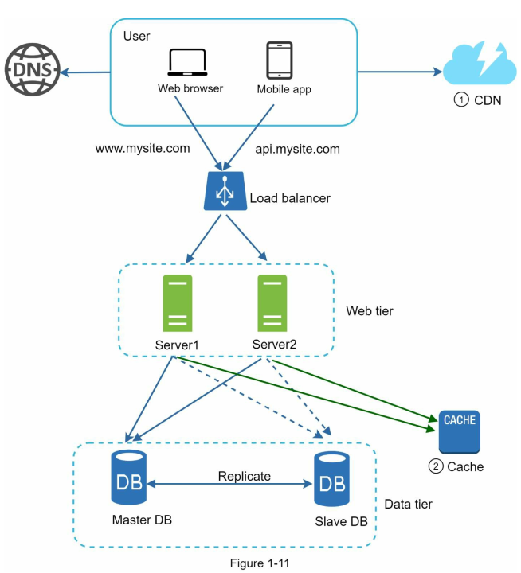

https://airbyte.com/data-engineering-resources/master-slave-replication

Ao conectar no banco de dados Master, executar procedimento de criação do usuário de replicação

`CREATE USER 'replication'@'%' IDENTIFIED WITH mysql_native_password BY 'password';
GRANT REPLICATION SLAVE ON *.* TO 'replication'@'%';
FLUSH PRIVILEGES;`

A seguir deverá obter as informações de onde estão armazenados os dados do banco de dados master para apontar no Slave

SHOW MASTER STATUS;

Agora no banco de dados Slave para que a replicação ocorra deve seguir os seguintes passos

execute a query alterando o log file e o position com as informações do master

`CHANGE REPLICATION SOURCE TO
    SOURCE_HOST = 'mysql_master',
    SOURCE_USER = 'replication',
    SOURCE_PASSWORD = 'password',
    SOURCE_LOG_FILE = 'mysql-bin.000003',
    SOURCE_LOG_POS = 2503;
START REPLICA;
`

Verifique o status do Slave aparece conforme a imagem abaixo

SHOW SLAVE STATUS;

Caso esteja tudo ok com a conexão entre os banco, agora crie a seguinte tabela no banco de dados master

`CREATE TABLE users_data (
    id INT AUTO_INCREMENT PRIMARY KEY,
    name VARCHAR(100) NOT NULL,
    second_name VARCHAR(100) NOT NULL,
    created_at TIMESTAMP DEFAULT CURRENT_TIMESTAMP,
    updated_at TIMESTAMP DEFAULT CURRENT_TIMESTAMP ON UPDATE CURRENT_TIMESTAMP
);
`

A tabela criada acima deverá aparecer também no banco de dados slave já que a replicação foi configurada.

No banco de dados slave execute a seguinte query, isso garantirá que nenhum usuário exceto o root possa fazer inserts no banco de dados.

SET GLOBAL read_only = 1;

observando os logs das APIS

criando usuários

chmod +x create_users.sh
chmod +x ping_users.sh

# scale-from-0-to-1-million

Nesse repositório você encontrará como implementar em ambiente local partes de um sistema que tem como finalidade escalar do 0 ao 1 milhão de usuários e entenderá o funcionamento de algumas dessas partes. O conhecimento obtido nesse repositório tem como origem o livro System Design Interview - An insider's guide. O tema sugerido encontra-se no primeiro capítulo do livro, e nele há muito mais detalhes e conhecimentos que podem ser adquiridos.

# Design

**Para esse escopo iremos descartar a aplicação WEB e iremos dar foco somente a partir do Load Balancer**

## O que é um Load Balancer?

Um Load Balancer (Balanceador de Carga) é um sistema que distribui dinamicamente o tráfego de rede entre vários servidores para otimizar desempenho, garantir alta disponibilidade e evitar sobrecarga.

Ele atua como um intermediário entre os clientes e os servidores backend, decidindo qual servidor deve processar cada requisição com base em diferentes estratégias.

- Reparte as requisições entre múltiplos servidores, evitando sobrecarga em um único recurso.
- Se um servidor falhar, o tráfego é redirecionado para os servidores saudáveis, garantindo que o sistema continue funcionando.
- Permite adicionar ou remover servidores dinamicamente conforme a demanda aumenta ou diminui.
- Reduz o tempo de resposta ao balancear cargas e evitar gargalos.
- Pode atuar como um proxy reverso, protegendo servidores backend de ataques diretos e mitigando ameaças como DDoS.

## O que é um API Server ?

Um API Server (Servidor de API) é um servidor responsável por processar requisições de APIs, geralmente seguindo os padrões RESTful ou GraphQL, e responder com os dados solicitados. Ele age como intermediário entre o frontend (clientes, apps, navegadores) e o backend (banco de dados, serviços, lógica de negócios).

- Gerenciar Requisições HTTP: Recebe requisições de clientes e retorna respostas.
- Executar Lógica de Negócio: Processa os dados antes de enviar ao cliente.
- Interagir com Bancos de Dados: Faz consultas, inserções e atualizações.
- Aplicar Autenticação e Segurança: Usa tokens JWT, OAuth ou API Keys.
- Gerenciar Taxas de Requisição (Rate Limiting): Evita sobrecarga no sistema.

## O que é um banco de dados?

Um banco de dados (Database) é um sistema organizado para armazenar, gerenciar e recuperar informações de forma eficiente. Ele permite que aplicativos e usuários consultem, modifiquem e armazenem dados de maneira estruturada.

## O que é a estrutura Master-Slave em Banco de Dados?

A arquitetura Master-Slave (também chamada de Primary-Replica) é um modelo de replicação de banco de dados onde um servidor principal (Master) recebe todas as operações de escrita e atualização, enquanto um ou mais servidores secundários (Slaves) replicam esses dados e lidam principalmente com operações de leitura.

- O banco de dados Master recebe todas as operações de escrita (INSERT, UPDATE, DELETE).
- Os bancos Slave recebem uma cópia dos dados do Master através da replicação e processam operações de leitura (SELECT).
- As mudanças feitas no Master são enviadas periodicamente para os Slaves, garantindo que os dados estejam sincronizados.

## O que é um Banco de Dados de Cache?

Um banco de dados de cache é um sistema otimizado para armazenar e recuperar dados rapidamente, reduzindo a carga sobre bancos de dados tradicionais e acelerando o tempo de resposta de aplicações. Ele mantém dados temporários na memória RAM, permitindo acessos ultrarrápidos.

- Alto Desempenho – Consultas são até 100x mais rápidas do que em bancos tradicionais.
- Armazenamento em Memória – Os dados ficam em RAM, garantindo baixa latência.
- Expiração Automática – Pode remover dados automaticamente após um período (TTL - Time To Live).
- Uso de Chave-Valor – Normalmente adota um formato simples como {chave: valor}.
  -Persistência Opcional – Alguns suportam salvar dados em disco para evitar perda.
