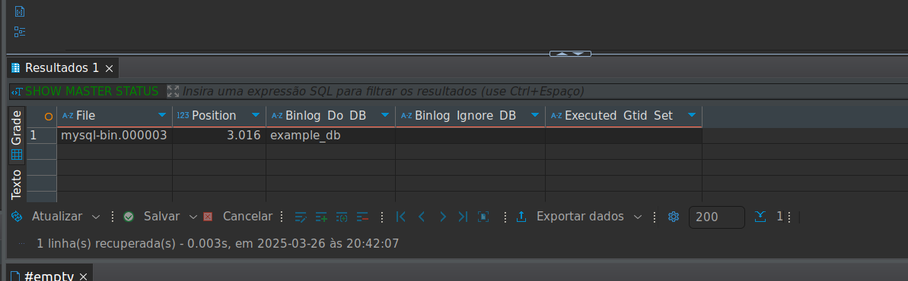

https://airbyte.com/data-engineering-resources/master-slave-replication

Ao conectar no banco de dados Master, executar procedimento de criação do usuário de replicação

`CREATE USER 'replication'@'%' IDENTIFIED WITH mysql_native_password BY 'password';
GRANT REPLICATION SLAVE ON *.* TO 'replication'@'%';
FLUSH PRIVILEGES;`

A seguir deverá obter as informações de onde estão armazenados os dados do banco de dados master para apontar no Slave

SHOW MASTER STATUS;

Agora no banco de dados Slave para que a replicação ocorra deve seguir os seguintes passos

execute a query alterando o log file e o position com as informações do master

`CHANGE REPLICATION SOURCE TO
    SOURCE_HOST = 'mysql_master',
    SOURCE_USER = 'replication',
    SOURCE_PASSWORD = 'password',
    SOURCE_LOG_FILE = 'mysql-bin.000003',
    SOURCE_LOG_POS = 2503;
START REPLICA;
`

Verifique o status do Slave aparece conforme a imagem abaixo

SHOW SLAVE STATUS;

Caso esteja tudo ok com a conexão entre os banco, agora crie a seguinte tabela no banco de dados master

`CREATE TABLE users_data (
    id INT AUTO_INCREMENT PRIMARY KEY,
    name VARCHAR(100) NOT NULL,
    second_name VARCHAR(100) NOT NULL,
    created_at TIMESTAMP DEFAULT CURRENT_TIMESTAMP,
    updated_at TIMESTAMP DEFAULT CURRENT_TIMESTAMP ON UPDATE CURRENT_TIMESTAMP
);
`

A tabela criada acima deverá aparecer também no banco de dados slave já que a replicação foi configurada.

No banco de dados slave execute a seguinte query, isso garantirá que nenhum usuário exceto o root possa fazer inserts no banco de dados.

SET GLOBAL read_only = 1;

observando os logs das APIS

criando usuários

chmod +x create_users.sh
chmod +x ping_users.sh
# scale-from-0-to-1-million
